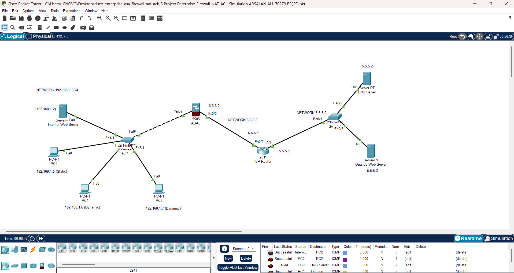

# Enterprise Network Security Design Using Cisco ASA Firewall (NAT + ACL)

A Cisco Packet Tracer project that designs and secures a small enterprise network using a Cisco ASA 5505 firewall — implementing NAT/PAT, DNS, and Access Control Lists to control inbound and outbound traffic between an inside (trusted) network and the outside internet.

> Simulator: Cisco Packet Tracer

---

## Table of Contents

- [Problem Statement](#problem-statement)
- [Network Topology](#network-topology)
- [IP Addressing Plan](#ip-addressing-plan)
- [NAT Mapping](#nat-mapping)
- [Requirements Implemented](#requirements-implemented)
- [Key Configuration](#key-configuration)
- [Testing & Results](#testing--results)
- [Repository Contents](#repository-contents)
- [How to Open This Project](#how-to-open-this-project)
- [Contributors](#contributors)

---

## Problem Statement

Design and manage the security policies of an enterprise network by configuring a Cisco ASA firewall and applying Access Control Lists (ACLs) to control inbound and outbound traffic between an internal company network and the outside internet/ISP.

---

## Network Topology



> Replace the image above with your actual Packet Tracer topology screenshot, saved as `docs/network-diagram.png`.

| Zone | Network | Description |
|---|---|---|
| Inside Network | `192.168.1.0/24` | Company LAN — PCs and Internal Web Server |
| Outside Network (to ISP) | `6.6.6.0/24` | Link between ASA firewall and ISP router |
| ISP to Remote Server Network | `5.5.5.0/24` | Public-facing network — DNS Server and Outside Web Server |

---

## IP Addressing Plan

| Device | Interface | IP Address | Gateway |
|---|---|---|---|
| ASA Firewall | Inside (VLAN 1) | 192.168.1.1 | — |
| ASA Firewall | Outside (VLAN 2) | 6.6.6.2 | — |
| ISP Router | Toward ASA | 6.6.6.1 | — |
| ISP Router | Toward Switch1 | 5.5.5.1 | — |
| Internal Web Server | Static | 192.168.1.2 | 192.168.1.1 |
| PC0 | Static | 192.168.1.5 | 192.168.1.1 |
| PC1 / PC2 | DHCP | 192.168.1.x | 192.168.1.1 |
| DNS Server | Static | 5.5.5.2 | 5.5.5.1 |
| Outside Web Server | Static | 5.5.5.3 | 5.5.5.1 |

---

## NAT Mapping

| Inside Address | Translated Address | Type |
|---|---|---|
| 192.168.1.0/24 (all inside hosts) | 6.6.6.2 | Dynamic PAT |
| 192.168.1.2 (Internal Web Server) | 6.6.6.3 | Static NAT |

---

## Requirements Implemented

- [x] **NAT/PAT configuration** — static NAT for the internal web server, dynamic PAT for all other inside hosts
- [x] **DNS server configuration** — `webserver.local` resolves to the outside web server
- [x] **Ping connectivity** — inside users can ping the remote DNS server and web server
- [x] **Inside → Outside web access** — inside users can browse the remote web server's `index.html`
- [x] **Outside → Inside web access** — outside users can reach the internal web server via its published static NAT address
- [x] **Selective access control** — one inside host (`192.168.1.5`) is fully blocked from the internet while all others retain access

---

## Key Configuration

### NAT / PAT
```
object network INTERNAL-WEBSERVER
 host 192.168.1.2
 nat (inside,outside) static 6.6.6.3

object network INSIDE-PAT
 subnet 192.168.1.0 255.255.255.0
 nat (inside,outside) dynamic interface
```

### Traffic Inspection
```
class-map inspection_default
 match default-inspection-traffic

policy-map global_policy
 class inspection_default
  inspect icmp
  inspect dns

service-policy global_policy global
```

### ACL — Outside to Inside
```
access-list OUTSIDE-IN extended permit tcp any host 6.6.6.3 eq 80
access-list OUTSIDE-IN extended permit icmp any any
access-list OUTSIDE-IN extended permit tcp any host 6.6.6.2
access-list OUTSIDE-IN extended permit udp any host 6.6.6.2
access-group OUTSIDE-IN in interface outside
```

### ACL — Block One Inside Host
```
access-list INSIDE-IN extended deny tcp host 192.168.1.5 any
access-list INSIDE-IN extended deny udp host 192.168.1.5 any
access-list INSIDE-IN extended deny icmp host 192.168.1.5 any
access-list INSIDE-IN extended permit tcp any any
access-list INSIDE-IN extended permit udp any any
access-list INSIDE-IN extended permit icmp any any
access-group INSIDE-IN in interface inside
```

### DNS Server
```
DNS: On
A Record — Name: webserver.local | Type: A Record | Address: 5.5.5.3
```

Full configuration and step-by-step explanation is in [`IS Final Project Enterprise ASA Firewall Report ARSALAN ALI 70279).pdf`]

---

## Testing & Results

| # | Requirement | Test | Result |
|---|---|---|---|
| 1 | NAT/PAT | `show xlate` on ASA | ✅ Static and dynamic translations active |
| 2 | DNS | `nslookup webserver.local` from PC1 | ✅ Resolved to 5.5.5.3 |
| 3 | Ping | `ping 5.5.5.2` / `ping 5.5.5.3` from PC1, PC2 | ✅ 0% packet loss |
| 4 | Inside → Outside web | `http://5.5.5.3` from PC1 browser | ✅ Page loaded |
| 5 | Outside → Inside web | `http://6.6.6.3` from DNS Server / Outside Web Server browser | ✅ Page loaded |
| 6 | Block PC0 | `ping 5.5.5.2` / `ping 5.5.5.3` from PC0 | ✅ 100% packet loss (blocked) |

Screenshot evidence for each test is included in the project report.

---

## Repository Contents

```
.
├── README.md
├── IS Final Project Enterprise ASA Firewall Report ARSALAN ALI 70279.pdf    # Full project report with screenshots
├── Viva_Preparation_Guide.pdf                      # Q&A study guide for viva/defense
├── IS Project Enterprise-Firewall-NAT-ACL-Simulation ARSALAN ALI  70279 BS(CS).pkt                            # Cisco Packet Tracer file
└── docs/
    └── network-diagram.png                         # Topology screenshot
```

---

## How to Open This Project

1. Install [Cisco Packet Tracer](https://www.netacad.com/courses/packet-tracer) (free with a Netacad account).
2. Clone or download this repository.
3. Open `network-topology.pkt` in Packet Tracer.
4. Click on **ASA0** → **CLI** tab to view/verify the firewall configuration.
5. Refer to the project report for step-by-step configuration and testing details.

---

## Contributors


| Arsalan Ali | 70279 |
| Azhar Ali   | 71079 |


**Course:** Information Security (CMC362) — Iqra University
**Instructor:** Dr. Sorath Mahar 
